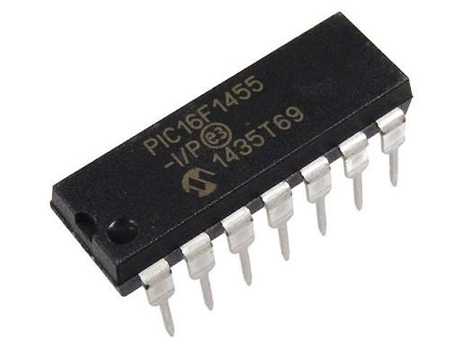

# PIC16F1455 USB HID Skeleton

**Compatible MCUs:** Microchip PIC16F1455, PIC16F1459, and PIC16F1454.

A crystal-less USB HID starter project for the PIC16F145x family. It includes a small firmware application, on-chip Flash read/write commands, a browser-based WebHID console, and a Python test client. The MPLAB X project currently targets the PIC16F1455; select the matching device and verify the package pinout when using another variant.



The PIC16F145x combines USB support with GPIO drive capability up to 20 mA per pin and low-power sleep modes, making it a capable choice for compact, power-conscious projects. Observe the datasheet's per-pin, port, and total-current limits; this USB example keeps the device active to maintain its connection, so its runtime power consumption depends on the operating conditions.

The firmware uses the PIC's internal oscillator and USB HID class support, so no external crystal or custom host driver is needed.

## Features

- USB Full-Speed operation using the internal oscillator, PLL, and Active Clock Tuning (ACT).
- Standard HID reports with 64-byte input and output payloads.
- Example commands to control an LED, exchange an application value, and inspect the main-loop counter.
- GPIO output drive up to 20 mA per pin, subject to device current limits and suitable load design.
- Low-power sleep modes available for applications that can suspend activity; this USB demo remains active while serving the connection.
- Two 32-byte Flash rows reserved for host read/write tests at `0x1FC0` and `0x1FE0`.
- Low-voltage programming enabled in the device configuration.
- A standalone WebHID interface and a Python `hidapi` test script.

## Hardware

The example wiring below is for the PIC16F1455 in a 14-pin DIP package.

```text
                 PIC16F1455 (DIP-14)
                     +-------+
       USB VBUS -----| 1   14 |----- USB GND
               RA5 --| 2   13 |-- USB D-
               RA4 --| 3   12 |-- USB D+
               RA3 --| 4   11 |-- VUSB3V3
               RC5 --| 5   10 |-- RC0
               RC4 --| 6    9 |-- RC1
    RC3 -- 1k -- LED | 7    8 |-- RC2
                     +-------+
```

| PIC pin | Signal | Connection |
| ---: | --- | --- |
| 1 | VDD | USB VBUS (5 V) |
| 14 | VSS | USB GND |
| 12 | D+ | USB D+ |
| 13 | D- | USB D- |
| 11 | VUSB3V3 | 0.47 uF ceramic capacitor to GND |
| 7 | RC3 | Optional LED through a 1 kOhm current-limiting resistor to GND |

Place a 0.1 uF bypass capacitor between VDD and VSS close to the PIC. Connect USB D+ and D- to the corresponding device pins.

## Build and Run

### Firmware

1. Install MPLAB X IDE and the XC8 compiler.
2. Open the `firmware` project in MPLAB X.
3. Build the `default` configuration and program the PIC16F1455 with an LVP-capable programmer.
4. Connect the board to USB. The example device uses VID `0x04D8` and PID `0x003C`.

### Browser console

Open [`host_tools/index.html`](host_tools/index.html) in a WebHID-compatible version of Google Chrome or Microsoft Edge. Select **Connect Device**, choose the PIC16F1455 HID device, then use the controls to operate the LED and read or write a Flash page.

### Python test client

Install the `hidapi` package and run the test script:

```bash
python -m pip install hidapi
python host_tools/test_pic_hid.py
```

> **Warning:** The Python test writes a test pattern to Flash page 1 (`0x1FE0-0x1FFF`). Back up any data in that page before running it.

## HID Protocol

All commands use 64-byte HID reports. In the tables below, byte 0 is the command in host requests and the result code in device responses. Unused bytes are zero-filled.

| Command | Request bytes | Response bytes |
| --- | --- | --- |
| `CMD_GET_STATUS` (`0x10`) | `[0x10, ...]` | `[status, LED, user value, loop count (4 bytes, MSB first), ...]` |
| `CMD_SET_STATUS` (`0x11`) | `[0x11, LED command, user value, ...]` | `[status, LED state, user value, ...]` |
| `CMD_GET_DATA` (`0x20`) | `[0x20, page, ...]` | `[status, page, address high, address low, 32 data bytes, ...]` |
| `CMD_SET_DATA` (`0x21`) | `[0x21, page, 0, 0, 32 data bytes, ...]` | `[status, page, address high, address low, 32 read-back bytes, ...]` |

The status byte is `0x00` on success and `0xFF` for an unsupported command or invalid page. LED commands are `0` (off), `1` (on), and `2` (toggle).

| Flash page | Address range | Size |
| --- | --- | ---: |
| 0 | `0x1FC0-0x1FDF` | 32 bytes |
| 1 | `0x1FE0-0x1FFF` | 32 bytes |

The initial page contents are defined by `g_user_flash_data` in [`firmware/src/user_app.c`](firmware/src/user_app.c).

## Project Layout

```text
pic16f1455-usb-hid-skeleton/
|-- firmware/
|   |-- src/
|       |-- main.c                # Clock, USB, and main loop
|       |-- user_app.c/.h         # Example application and HID commands
|       |-- usb_descriptors.c     # USB IDs, strings, and HID report descriptor
|       `-- usb_device*.c/.h      # USB device implementation
|-- host_tools/
|   |-- index.html                # WebHID console
|   `-- test_pic_hid.py           # Python test client
|-- LICENSE
`-- README.md
```

## Customization

- Add application state and command identifiers in `firmware/src/user_app.h`; implement command handling in `hid_user_interface()` in `firmware/src/user_app.c`.
- Update the manufacturer/product strings and USB identifiers in `firmware/src/usb_descriptors.c`. The example uses VID `0x04D8`; use identifiers you are authorized to use for any distributed product.
- The LED example is connected to RC3. Change the pin definition and initialization if your hardware uses a different output.
- The example reserves two Flash rows. Adjust the range only after checking the PIC16F1455 memory map and ensuring it does not overlap firmware.

## License

This project is released under the [BSD 2-Clause License](LICENSE). Parts of the USB driver are based on the Microchip Technology Inc. framework.